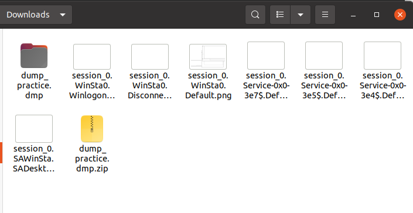

1. Essayez le plugin screenshot pour obtenir une image des bureaux actuels.
```bash
python2 vol.py  -f $vfile --profile=WinXPSP3x86 screenshot --dump-dir=/home/ubuntu/Downloads/
Volatility Foundation Volatility Framework 2.6.1
Wrote /home/ubuntu/Downloads/session_0.SAWinSta.SADesktop.png
Wrote /home/ubuntu/Downloads/session_0.Service-0x0-3e5$.Default.png
Wrote /home/ubuntu/Downloads/session_0.Service-0x0-3e4$.Default.png
Wrote /home/ubuntu/Downloads/session_0.Service-0x0-3e7$.Default.png
Wrote /home/ubuntu/Downloads/session_0.WinSta0.Default.png
Wrote /home/ubuntu/Downloads/session_0.WinSta0.Disconnect.png
Wrote /home/ubuntu/Downloads/session_0.WinSta0.Winlogon.png

```


```shell
python2 vol.py  -f $vfile consoles
Volatility Foundation Volatility Framework 2.6.1
**************************************************
ConsoleProcess: csrss.exe Pid: 560
Console: 0x4e23b0 CommandHistorySize: 50
HistoryBufferCount: 1 HistoryBufferMax: 4
OriginalTitle: ??ystemRoot%\system32\cmd.exe
Title: ??\WINDOWS\system32\cmd.exe
**************************************************
ConsoleProcess: csrss.exe Pid: 560
Console: 0x12c3600 CommandHistorySize: 50
HistoryBufferCount: 1 HistoryBufferMax: 4
OriginalTitle: 
Title: 

```

# Analyse d'un processus spécifique.

1. Déterminez le PID du processus Bloc-notes, comme dans l'exercice précédent.
Ensuite, déterminez les threads du processus en utilisant: volatility threads -p PID

```shell
python2 vol.py  -f $vfile psscan | grep notepad
Volatility Foundation Volatility Framework 2.6.1
0x0000000001f83e68 notepad.exe        1788   1596 0x12f9f000 2015-12-23 01:42:15 UTC+0000   2016-01-03 22:55:04 UTC+0000  
0x0000000001fca4c0 notepad.exe        1088   1596 0x0288f000 2016-01-03 22:56:02 UTC+0000                                 
0x00000000020794c0 notepad.exe        1260   1596 0x13680000 2015-12-23 01:20:49 UTC+0000   2015-12-23 01:40:40 UTC+0000  
0x000000000230fdb0 notepad.exe        1928   1596 0x02ab7000 2015-12-23 01:40:43 UTC+0000   2015-12-23 01:42:11 UTC+0000 
```

On remarque que le seul process qui a des threads actives est 1088/

```shell
 python2 vol.py  -f $vfile threads -p 1088
Volatility Foundation Volatility Framework 2.6.1
[x86] Gathering all referenced SSDTs from KTHREADs...
Finding appropriate address space for tables...
------
ETHREAD: 0x81f99da8 Pid: 1088 Tid: 1488
Tags: 
Created: 2016-01-03 22:56:02 UTC+0000
Exited: 1970-01-01 00:00:00 UTC+0000
Owning Process: notepad.exe
Attached Process: notepad.exe
State: Waiting:WrUserRequest
BasePriority: 0x8
Priority: 0xa
TEB: 0x7ffdd000
StartAddress: 0x7c810867 kernel32.dll
ServiceTable: 0x80559440
  [0] 0x804e26a8
  [1] 0xbf997600
  [2] 0x00000000
  [3] 0x00000000
Win32Thread: 0xe19a85a0
CrossThreadFlags: 
Eip: 0x7c90eb94
  eax=0x0007fa6c ebx=0x006a0287 ecx=0x00000001 edx=0x00000011 esi=0x0007fefc edi=0x77d491a3
  eip=0x7c90eb94 esp=0x0007febc ebp=0x0007fed8 err=0x00000000
  cs=0x1b ss=0x23 ds=0x23 es=0x23 gs=0x00 fs=0x3b efl=0x00000246
  dr0=0x00000000 dr1=0x00000000 dr2=0x00000000 dr3=0x00000000 dr6=0x00000000 dr7=0x00000000
0x7c810867 33ed             XOR EBP, EBP
0x7c810869 50               PUSH EAX
0x7c81086a 6a00             PUSH 0x0
0x7c81086c e9bb640000       JMP 0x7c816d2c
0x7c810871 90               NOP
0x7c810872 8bff             MOV EDI, EDI
0x7c810874 90               NOP
0x7c810875 90               NOP
0x7c810876 90               NOP
0x7c810877 90               NOP
0x7c810878 90               NOP
0x7c810879 64               DB 0x64
0x7c81087a 8b               DB 0x8b
0x7c81087b 15               DB 0x15
0x7c81087c 1800             SBB [EAX], AL
0x7c81087e 00               DB 0x0

```

2.  En raison du fait que Notepad ne contient qu'un seul thread, l'interface utilisateur peut sembler bloquée pendant que la recherche et le remplacement sont en cours. Cela signifie que si une énorme quantité de texte est analysée, l'interface utilisateur de Notepad peut sembler ne pas répondre jusqu'à ce que la recherche et le remplacement soient terminés.

Il est possible d'annuler l'opération de recherche et de remplacement en cliquant sur le bouton "Annuler" ou en appuyant sur la touche "Echap" pendant que l'opération est en cours. Cela enverra une demande d'annulation au thread de recherche et de remplacement en cours. Cependant, en raison du fait que Notepad ne contient qu'un seul thread, il est possible que l'annulation ne soit pas immédiatement prise en compte, ce qui peut rendre l'interface utilisateur non réactive pendant un certain temps.

3. *Tâche facultative :*
3.1. 
```bash
python2 vol.py  -f $vfile volshell -p 1088
Volatility Foundation Volatility Framework 2.6.1
Current context: notepad.exe @ 0x81fc8020, pid=1088, ppid=1596 DTB=0x288f000
Python 2.7.18 (default, Jul  1 2022, 12:27:04) 
Type "copyright", "credits" or "license" for more information.

IPython 5.10.0 -- An enhanced Interactive Python.
?         -> Introduction and overview of IPython's features.
%quickref -> Quick reference.
help      -> Python's own help system.
object?   -> Details about 'object', use 'object??' for extra details.

In [1]: hh()

Use addrspace() for Kernel/Virtual AS
Use addrspace().base for Physical AS
Use proc() to get the current process object
  and proc().get_process_address_space() for the current process AS
  and proc().get_load_modules() for the current process DLLs

addrspace()                              : Get the current kernel/virtual address space. 
cc(offset=None, pid=None, name=None, physical=False) : Change current shell context.
db(address, length=128, space=None)      : Print bytes as canonical hexdump.
dd(address, length=128, space=None)      : Print dwords at address.
dis(address, length=128, space=None, mode=None) : Disassemble code at a given address.
dq(address, length=128, space=None)      : Print qwords at address.
dt(objct, address=None, space=None, recursive=False, depth=0) : Describe an object or show type info.
find(needle, max=1, shift=0, skip=0, count=False, length=128) : 
getmods()                                : Generator for kernel modules (scripting).
getprocs()                               : Generator of process objects (scripting).
hh(cmd=None)                             : Get help on a command.
list_entry(head, objname, offset=-1, fieldname=None, forward=True, space=None) : Traverse a _LIST_ENTRY.
modules()                                : Print loaded modules in a table view.
proc()                                   : Get the current process object.
ps()                                     : Print active processes in a table view.
sc()                                     : Show the current context.

For help on a specific command, type 'hh(<command>)'


```

Pour obtenir une liste des instructions sur le point d'être exécutées, nous allons
désassembler une partie de la mémoire :

```assembly
In [2]: dis(0x7c90eb94)
0x7c90eb94 c3                               RET
0x7c90eb95 8da42400000000                   LEA ESP, [ESP+0x0]
0x7c90eb9c 8d642400                         LEA ESP, [ESP+0x0]
0x7c90eba0 90                               NOP
0x7c90eba1 90                               NOP
0x7c90eba2 90                               NOP
0x7c90eba3 90                               NOP
0x7c90eba4 90                               NOP
0x7c90eba5 8d542408                         LEA EDX, [ESP+0x8]
0x7c90eba9 cd2e                             INT 0x2e
0x7c90ebab c3                               RET
0x7c90ebac 55                               PUSH EBP
0x7c90ebad 8bec                             MOV EBP, ESP
0x7c90ebaf 9c                               PUSHF
0x7c90ebb0 81ecd0020000                     SUB ESP, 0x2d0
0x7c90ebb6 8985dcfdffff                     MOV [EBP-0x224], EAX
0x7c90ebbc 898dd8fdffff                     MOV [EBP-0x228], ECX
0x7c90ebc2 8b4508                           MOV EAX, [EBP+0x8]
0x7c90ebc5 8b4d04                           MOV ECX, [EBP+0x4]
0x7c90ebc8 89480c                           MOV [EAX+0xc], ECX
0x7c90ebcb 8d852cfdffff                     LEA EAX, [EBP-0x2d4]
0x7c90ebd1 8988b8000000                     MOV [EAX+0xb8], ECX
0x7c90ebd7 8998a4000000                     MOV [EAX+0xa4], EBX
0x7c90ebdd 8990a8000000                     MOV [EAX+0xa8], EDX
0x7c90ebe3 89b0a0000000                     MOV [EAX+0xa0], ESI
0x7c90ebe9 89b89c000000                     MOV [EAX+0x9c], EDI
0x7c90ebef 8d4d0c                           LEA ECX, [EBP+0xc]
0x7c90ebf2 8988c4000000                     MOV [EAX+0xc4], ECX
0x7c90ebf8 8b4d00                           MOV ECX, [EBP+0x0]
0x7c90ebfb 8988b4000000                     MOV [EAX+0xb4], ECX
0x7c90ec01 8b4dfc                           MOV ECX, [EBP-0x4]
0x7c90ec04 8988c0000000                     MOV [EAX+0xc0], ECX
0x7c90ec0a 8c88bc000000                     MOV [EAX+0xbc], CS
0x7c90ec10 8c                               DB 0x8c
0x7c90ec11 98                               CWDE
0x7c90ec12 98                               CWDE
0x7c90ec13 00                               DB 0x0

```

#### Sortir du shell avec Ctrl+Z (Windows) ou Ctrl+D (Linux).

1. Lors de l''analyse de notepad, nous nous intéressons au texte actuellement affiché :
   ```shell
   python2 vol.py  -f $vfile editbox -p 1088

Volatility Foundation Volatility Framework 2.6.1
******************************
Wnd Context       : 0\WinSta0\Default
Process ID        : 1088
ImageFileName     : notepad.exe
IsWow64           : No
atom_class        : 6.0.2600.2180!Edit
value-of WndExtra : 0xa9cd0
nChars            : 17
selStart          : 17
selEnd            : 17
isPwdControl      : False
undoPos           : 17
undoLen           : 5
address-of undoBuf: 0xa9e20
undoBuf           :  Mhm.
-------------------------
You are the best.

```

```shell
python2 vol.py  -f $vfile notepad -p 1088
Volatility Foundation Volatility Framework 2.6.1
Process: 1088
Text:
You are the best. Mhm. g

```

2. Ensuite, nous nous concentrons sur le processus Paint.

```shell
python2 vol.py  -f $vfile vadinfo -p 1772
Volatility Foundation Volatility Framework 2.6.1
************************************************************************
Pid:   1772
VAD node @ 0x82188d18 Start 0x003b0000 End 0x003bffff Tag VadS
Flags: CommitCharge: 8, PrivateMemory: 1, Protection: 4
Protection: PAGE_READWRITE

VAD node @ 0x8207c940 Start 0x000a0000 End 0x0019ffff Tag Vadl
Flags: CommitCharge: 32, PrivateMemory: 1, Protection: 4
Protection: PAGE_READWRITE
First prototype PTE: 00000000 Last contiguous PTE: 00000000
Flags2: LongVad: 1, ReadOnly: 1

VAD node @ 0x81ff8d00 Start 0x00020000 End 0x00020fff Tag VadS
Flags: CommitCharge: 1, MemCommit: 1, PrivateMemory: 1, Protection: 4
Protection: PAGE_READWRITE

VAD node @ 0x82042040 Start 0x00010000 End 0x00010fff Tag VadS
Flags: CommitCharge: 1, MemCommit: 1, PrivateMemory: 1, Protection: 4
Protection: PAGE_READWRITE

VAD node @ 0x821c0d80 Start 0x00080000 End 0x00082fff Tag Vad 
Flags: NoChange: 1, Protection: 1
Protection: PAGE_READONLY
ControlArea @821785d0 Segment e14d2920
NumberOfSectionReferences:          1 NumberOfPfnReferences:           0
NumberOfMappedViews:               11 NumberOfUserReferences:         12
Control Flags: Commit: 1, HadUserReference: 1
First prototype PTE: e14d2958 Last contiguous PTE: e14d2960
Flags2: Inherit: 1, SecNoChange: 1

VAD node @ 0x8203ebe0 Start 0x00040000 End 0x0007ffff Tag Vadl
Flags: CommitCharge: 4, PrivateMemory: 1, Protection: 4
Protection: PAGE_READWRITE
First prototype PTE: 00000000 Last contiguous PTE: 00000000
Flags2: LongVad: 1

VAD node @ 0x81ff0288 Start 0x00030000 End 0x0003ffff Tag VadS
Flags: CommitCharge: 16, PrivateMemory: 1, Protection: 4
Protection: PAGE_READWRITE

VAD node @ 0x82040220 Start 0x00090000 End 0x00091fff Tag Vad 
Flags: NoChange: 1, Protection: 1
Protection: PAGE_READONLY
ControlArea @8202d268 Segment e19c8708
NumberOfSectionReferences:          0 NumberOfPfnReferences:           0
NumberOfMappedViews:                1 NumberOfUserReferences:          1
Control Flags: Commit: 1, HadUserReference: 1
First prototype PTE: e19c8740 Last contiguous PTE: e19c8744
Flags2: Inherit: 1, SecNoChange: 1
```
3. Nous pouvons noter que notre processus contient beaucoup de ces segments, car
l'espace d'adressage comprend toutes les bibliothèques DLL dont ce programme a
besoin (c'est maintenant le bon moment pour revoir l'image 2). Pour accélérer
l'analyse, nous devons ignorer les segments qui n'appartiennent pas au tas. Nous
pouvons le faire en utilisant une représentation graphique d'une structure VAD:
```shell
python2 vol.py  -f $vfile vadtree -p 1772 --output=dot --output-file=vads.dot
Volatility Foundation Volatility Framework 2.6.1
Outputting to: vads.dot
```

![[forensicsEnsao/Pasted image 20230421224836.png]]


5. Donc, maintenant, nous avons juste besoin d&#39;obtenir le contenu réel de ces segments
de mémoire.
```shell
python2 vol.py -f $vfile vaddump -p 1772 -D /home/ubuntu/Desktop 
Volatility Foundation Volatility Framework 2.6.1
Pid        Process              Start      End        Result
---------- -------------------- ---------- ---------- ------
      1772 mspaint.exe          0x003b0000 0x003bffff /home/ubuntu/Desktop/mspaint.exe.230ada0.0x003b0000-0x003bffff.dmp
      1772 mspaint.exe          0x000a0000 0x0019ffff /home/ubuntu/Desktop/mspaint.exe.230ada0.0x000a0000-0x0019ffff.dmp
      1772 mspaint.exe          0x00020000 0x00020fff /home/ubuntu/Desktop/mspaint.exe.230ada0.0x00020000-0x00020fff.dmp
      1772 mspaint.exe          0x00010000 0x00010fff /home/ubuntu/Desktop/mspaint.exe.230ada0.0x00010000-0x00010fff.dmp
      1772 mspaint.exe          0x00080000 0x00082fff /home/ubuntu/Desktop/mspaint.exe.230ada0.0x00080000-0x00082fff.dmp
      1772 mspaint.exe          0x00040000 0x0007ffff /home/ubuntu/Desktop/mspaint.exe.230ada0.0x00040000-0x0007ffff.dmp
      1772 mspaint.exe          0x00030000 0x0003ffff /home/ubuntu/Desktop/mspaint.exe.230ada0.0x00030000-0x0003ffff.dmp
      1772 mspaint.exe          0x00090000 0x00091fff /home/ubuntu/Desktop/mspaint.exe.230ada0.0x00090000-0x00091fff.dmp
      1772 mspaint.exe          0x001e0000 0x0021cfff /home/ubuntu/Desktop/mspaint.exe.230ada0.0x001e0000-0x0021cfff.dmp
      1772 mspaint.exe          0x001b0000 0x001bffff /home/ubuntu/Desktop/mspaint.exe.230ada0.0x001b0000-0x001bffff.dmp
      1772 mspaint.exe          0x001a0000 0x001affff /home/ubuntu/Desktop/mspaint.exe.230ada0.0x001a0000-0x001affff.dmp
      1772 mspaint.exe          0x001c0000 0x001d5fff /home/ubuntu/Desktop/mspaint.exe.230ada0.0x001c0000-0x001d5fff.dmp
      1772 mspaint.exe          0x00270000 0x00275fff /home/ubuntu/Desktop/mspaint.exe.230ada0.0x00270000-0x00275fff.dmp
      1772 mspaint.exe          0x00220000 0x00260fff /home/ubuntu/Desktop/mspaint.exe.230ada0.0x00220000-0x00260fff.dmp
      1772 mspaint.exe          0x00280000 0x00347fff /home/ubuntu/Desktop/mspaint.exe.230ada0.0x00280000-0x00347fff.dmp
      1772 mspaint.exe          0x00350000 0x00350fff /home/ubuntu/Desktop/mspaint.exe.230ada0.0x00350000-0x00350fff.dmp
      1772 mspaint.exe          0x00360000 0x00360fff /home/ubuntu/Desktop/mspaint.exe.230ada0.0x00360000-0x00360fff.dmp
      1772 mspaint.exe          0x00380000 0x00381fff /home/ubuntu/Desktop/mspaint.exe.230ada0.0x00380000-0x00381fff.dmp
      1772 mspaint.exe          0x00370000 0x00371fff /home/ubuntu/Desktop/mspaint.exe.230ada0.0x00370000-0x00371fff.dmp
      1772 mspaint.exe          0x00390000 0x0039ffff /home/ubuntu/Desktop/mspaint.exe.230ada0.0x00390000-0x0039ffff.dmp
      1772 mspaint.exe          0x003a0000 0x003affff /home/ubuntu/Desktop/mspaint.exe.230ada0.0x003a0000-0x003affff.dmp
      
```
Donc, maintenant, nous avons juste besoin d'obtenir le contenu réel de ces segments
de mémoire.
```shell
python2 vol.py -f $vfile vaddump -p 1772 -D /home/ubuntu/Desktop/output/
Volatility Foundation Volatility Framework 2.6.1
Pid        Process              Start      End        Result
---------- -------------------- ---------- ---------- ------
      1772 mspaint.exe          0x003b0000 0x003bffff /home/ubuntu/Desktop/output/mspaint.exe.230ada0.0x003b0000-0x003bffff.dmp
      1772 mspaint.exe          0x000a0000 0x0019ffff /home/ubuntu/Desktop/output/mspaint.exe.230ada0.0x000a0000-0x0019ffff.dmp
      1772 mspaint.exe          0x00020000 0x00020fff /home/ubuntu/Desktop/output/mspaint.exe.230ada0.0x00020000-0x00020fff.dmp
      1772 mspaint.exe          0x00010000 0x00010fff /home/ubuntu/Desktop/output/mspaint.exe.230ada0.0x00010000-0x00010fff.dmp
      1772 mspaint.exe          0x00080000 0x00082fff /home/ubuntu/Desktop/output/mspaint.exe.230ada0.0x00080000-0x00082fff.dmp
      1772 mspaint.exe          0x00040000 0x0007ffff /home/ubuntu/Desktop/output/mspaint.exe.230ada0.0x00040000-0x0007ffff.dmp
      1772 mspaint.exe          0x00030000 0x0003ffff /home/ubuntu/Desktop/output/mspaint.exe.230ada0.0x00030000-0x0003ffff.dmp
      1772 mspaint.exe          0x00090000 0x00091fff /home/ubuntu/Desktop/output/mspaint.exe.230ada0.0x00090000-0x00091fff.dmp
      1772 mspaint.exe          0x001e0000 0x0021cfff /home/ubuntu/Desktop/output/mspaint.exe.230ada0.0x001e0000-0x0021cfff.dmp
      1772 mspaint.exe          0x001b0000 0x001bffff /home/ubuntu/Desktop/output/mspaint.exe.230ada0.0x001b0000-0x001bffff.dmp
      1772 mspaint.exe          0x001a0000 0x001affff /home/ubuntu/Desktop/output/mspaint.exe.230ada0.0x001a0000-0x001affff.dmp
      1772 mspaint.exe          0x001c0000 0x001d5fff /home/ubuntu/Desktop/output/mspaint.exe.230ada0.0x001c0000-0x001d5fff.dmp
      1772 mspaint.exe          0x00270000 0x00275fff /home/ubuntu/Desktop/output/mspaint.exe.230ada0.0x00270000-0x00275fff.dmp
      1772 mspaint.exe          0x00220000 0x00260fff /home/ubuntu/Desktop/output/mspaint.exe.230ada0.0x00220000-0x00260fff.dmp
      1772 mspaint.exe          0x00280000 0x00347fff /home/ubuntu/Desktop/output/mspaint.exe.230ada0.0x00280000-0x00347fff.dmp
      1772 mspaint.exe          0x00350000 0x00350fff /home/ubuntu/Desktop/output/mspaint.exe.230ada0.0x00350000-0x00350fff.dmp
      1772 mspaint.exe          0x00360000 0x00360fff /home/ubuntu/Desktop/output/mspaint.exe.230ada0.0x00360000-0x00360fff.dmp
      1772 mspaint.exe          0x00380000 0x00381fff /home/ubuntu/Desktop/output/mspaint.exe.230ada0.0x00380000-0x00381fff.dmp
      1772 mspaint.exe          0x00370000 0x00371fff /home/ubuntu/Desktop/output/mspaint.exe.230ada0.0x00370000-0x00371fff.dmp
      1772 mspaint.exe          0x00390000 0x0039ffff /home/ubuntu/Desktop/output/mspaint.exe.230ada0.0x00390000-0x0039ffff.dmp

```
